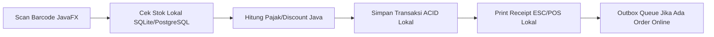
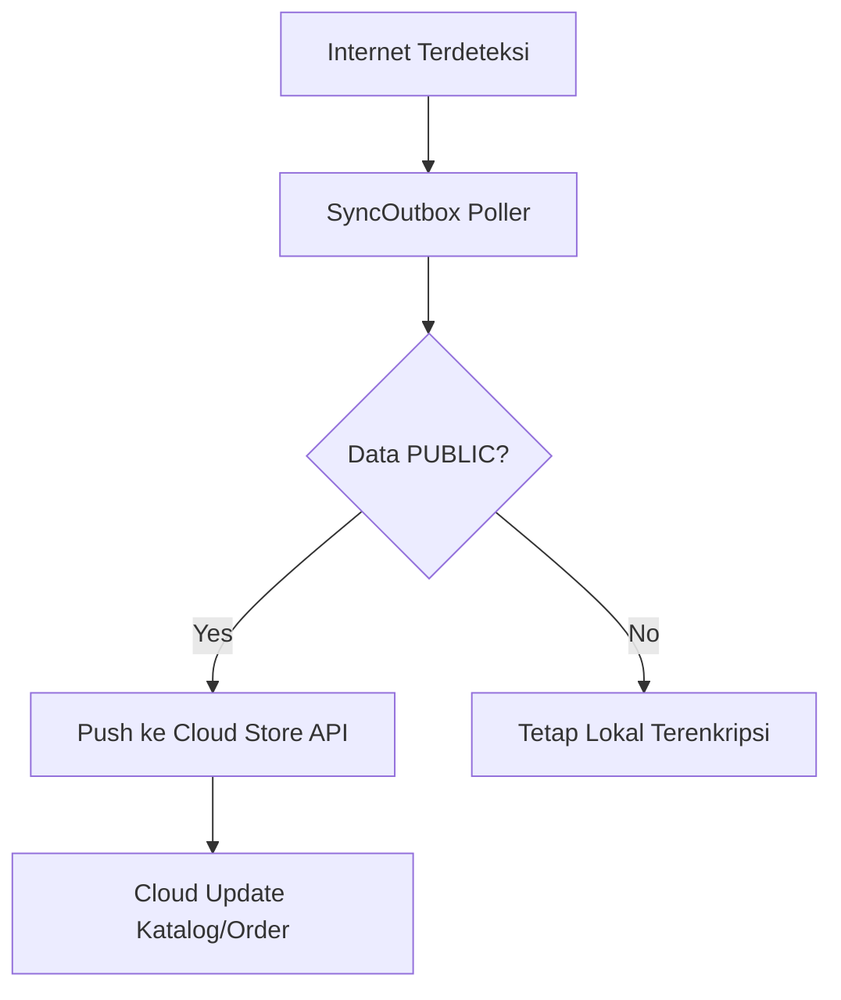
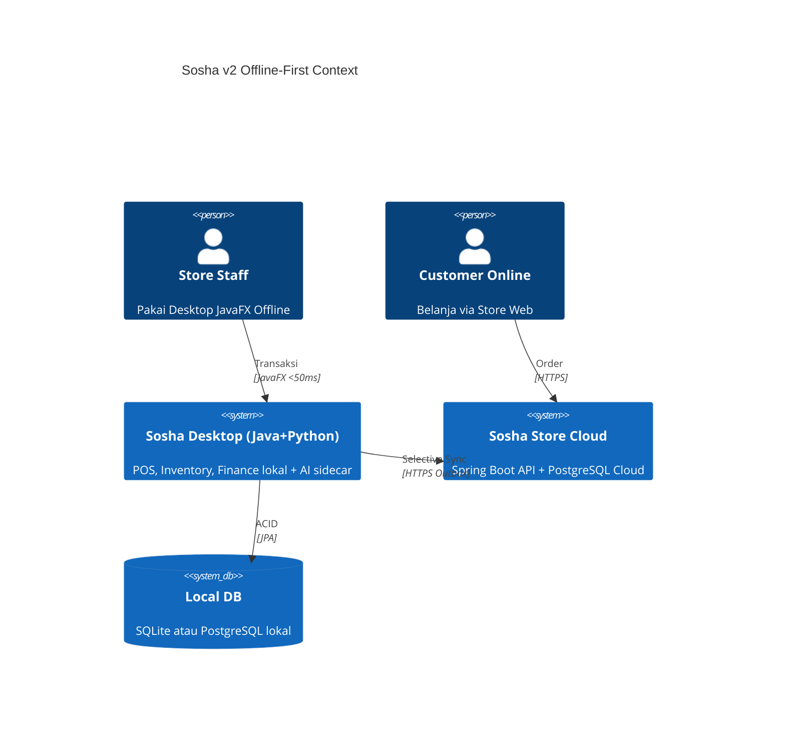

### SOSHA POS & INVENTORY MANAGEMENT SYSTEM VOLUME 0 PRODUCT BLUEPRINT

---

**Document Control**

| Attribute | Details |
| :--- | :--- |
| **Project Name** | Sosha POS & Inventory Management System |
| **Document Type** | Product Blueprint (Volume 0) |
| **Version** | 2.0.0-RELEASE |
| **Status** | Final / Approved - Java + Python Offline-First Edition |
| **Author** | Senior Enterprise Architect |
| **Date** | August 31, 2026 |
| **Confidentiality** | Enterprise Confidential |

---

## 1. Revision History

| Date | Version | Description | Author | Approval |
| :--- | :--- | :--- | :--- | :--- |
| 2024-08-04 | 1.0.0 | Initial Blueprint: Cloud-Native Supabase/React | Architect | Steering Committee |
| 2026-08-31 | 2.0.0 | Major Pivot: Java+Python Desktop Offline-First, Store Online, Privacy Partitioning, Dual-DB (SQLite/PostgreSQL) | Architect | Steering Committee |

---

## 2. Table of Contents

1.  Vision & Mission
2.  Business Goals
3.  Target Market
4.  Competitor Analysis
5.  Business Model
6.  Value Proposition
7.  User Personas
8.  Product Positioning
9.  Feature Roadmap
10. Module Overview
11. Business Workflow
12. High-Level Architecture (Hybrid Offline-First)
13. Technology Stack (Java 21 + Python 3.11)
14. Database Strategy (Dual-Mode: SQLite / PostgreSQL)
15. Folder Structure
16. Git Strategy
17. Coding Standard & Naming Convention
18. Development Timeline & Milestones
19. Risk Analysis
20. Success Criteria
21. Glossary
22. Appendix - Why Java + Python + Offline Desktop?

---

## 3. Vision

**To become the global standard for unified commerce by providing an intelligent, privacy-first, offline-resilient POS & Inventory operating system that runs natively on desktop without dependency on internet.**

*Explanation:* Sosha v2 is re-architected as **Desktop Offline-First**. Store Online tetap jalan 24/7 untuk e-commerce, namun semua pekerjaan administrasi (Finance, HR, Profit, Supplier Cost) tetap offline di device user. Data sensitif tidak pernah menyentuh cloud.

## 4. Mission

*   **Privacy-by-Design:** Data administrasi bersifat `localOnly`, terenkripsi AES-256-GCM di disk, tidak disinkronkan.
*   **Offline Resiliency:** POS & Inventory 100% fungsional tanpa internet (ACID lokal).
*   **Intelligence Local:** Forecast & Anomaly Detection berjalan lokal via Python sidecar (tanpa kirim data ke cloud).
*   **Scalable Choice:** User pilih DB sesuai spek komputer: SQLite (ringan) atau PostgreSQL (enterprise).
*   **Speed:** Sub-50ms POS latency karena komputasi lokal.

---

## 5. Business Goals

| Goal ID | Category | Description | KPI Target |
| :--- | :--- | :--- | :--- |
| **BG-001** | Offline | POS tetap transaksi saat internet mati 30 hari | 100% offline uptime |
| **BG-002** | Privacy | Data `PRIVATE` tidak pernah keluar device | 0 byte leak (audit) |
| **BG-003** | Store Online | E-commerce sync selektif saat online | < 2s sync outbox |
| **BG-004** | Adaptability | Support spek low-end hingga enterprise via Dual-DB | Install di 2GB RAM hingga 64GB |
| **BG-005** | Efficiency | Kurangi stock counting manual via AI lokal | 40% Reduction |

---

## 6. Target Market

1.  **Large Retail Chains:** Butuh offline di cabang dengan internet tidak stabil.
2.  **FMCG Distributors:** Strict Batch/Expiry, tidak ingin data harga supplier bocor ke cloud.
3.  **Privacy-Conscious SME:** UMKM yang ingin laporan laba tidak di cloud.
4.  **Franchise:** Pusat butuh kontrol katalog online, cabang butuh otonomi offline.

---

## 7. Competitor Analysis

| Feature | Sosha v2 (Java/Python Offline) | Odoo Enterprise | Square POS | NetSuite |
| :--- | :--- | :--- | :--- | :--- |
| **Architecture** | Desktop Native (JavaFX) + Python Sidecar | Monolithic Python Cloud | Cloud SaaS | Cloud |
| **Offline Mode** | 100% Native (SQLite/PostgreSQL lokal) | Limited | No | No |
| **Data Privacy Admin** | LocalOnly encrypted, no sync | Cloud | Cloud | Cloud |
| **Store Online** | Selective Sync (Outbox) | Full Cloud | Full Cloud | Full Cloud |
| **DB Choice** | SQLite (Lite) / PostgreSQL (Scale) | PostgreSQL only | Proprietary | Oracle |
| **AI** | Local Python (offline) | Cloud | Add-on | Cloud |
| **Cost** | One-time license + VPS ringan | Per user/mo | Transaction % | Very High |

---

## 8. Business Model

**Hybrid: Desktop License + VPS Store Online**

1.  **Desktop License (One-time / Annual):** Include JavaFX app + Python AI sidecar + Pilihan DB.
2.  **Store Online Hosting:** VPS Docker (Spring Boot Store API) - pay-as-you-go ringan.
3.  **Add-on:** AI Forecasting Pack (lokal, no extra cloud cost).

---

## 9. Value Proposition

1.  **True Offline:** Buka toko di daerah 3T tanpa internet tetap jalan.
2.  **Privacy Guaranteed:** Laporan keuangan, gaji, HPP supplier tidak pernah ke internet - audit `sync_outbox` membuktikan.
3.  **Adaptive Performance:** Spek kentang pakai SQLite, spek dewa pakai PostgreSQL - satu codebase via JPA Dialect.
4.  **Selective Sync:** Hanya katalog publish, stok publish, order online yang sync. Sisanya lokal.

---

## 10. User Personas

| Persona | Role | Pain Point | Goal in Sosha v2 |
| :--- | :--- | :--- | :--- |
| **Sarah (Owner)** | CEO | Takut data laba bocor di cloud | Laporan lokal terenkripsi, tidak sync |
| **David (Manager)** | Warehouse | Internet gudang sering mati | Tetap input stock via SQLite lokal |
| **Jenny (Cashier)** | Cashier | POS lemot saat internet lambat | POS <50ms lokal |
| **Mark (IT Admin)** | IT | Butuh skalabilitas | Pilih PostgreSQL saat scale |

---

## 11. Product Positioning

**"The Privacy-First, Offline-First Retail OS - Java Power, Python Brain."**

Di antara Square (cloud-only) dan SAP (mahal), Sosha v2 adalah satu-satunya yang menjamin kerahasiaan admin dengan tetap punya store online.

---

## 12. Feature Roadmap

### Phase 1: Core Desktop (Months 1-3)
*   JavaFX + Spring Boot Embedded + Dual-DB abstraction
*   Auth lokal (encrypted), RBAC, Product & POS offline

### Phase 2: Privacy & Store (Months 4-6)
*   Partition `sync_policy` (PUBLIC/PRIVATE), Outbox Sync Engine
*   Store Online Spring Boot API + PostgreSQL Cloud

### Phase 3: Python Intelligence (Months 7-9)
*   Python FastAPI sidecar (Prophet, Scikit-learn) lokal
*   Anomaly detection & forecasting offline

---

## 13. Module Overview

| Module | Sub-Modules | Offline? | Sync? |
| :--- | :--- | :--- | :--- |
| **Identity** | Auth, RBAC, Profiles | Yes | No (lokal) |
| **Catalog** | Products, Categories | Yes | Selective (publish only) |
| **Inventory** | Adjustments, Transfers | Yes | No (lokal) |
| **Sales** | POS, Invoicing | Yes | Partial (order online sync) |
| **Store Online** | Cart, Checkout, Payment | No (cloud) | Yes |
| **Finance** | Ledger, P/L, Tax | Yes | No (PRIVATE) |
| **Python AI** | Forecast, Anomaly, RAG | Yes (localhost) | No |

---

## 14. Business Workflow

### 14.1 Order-to-Cash Offline


### 14.2 Sync Store Online (Selective)


---

## 15. High-Level Architecture



---

## 16. Technology Stack

### 16.1 Desktop Frontend & Logic (Java)
*   **Runtime:** Java 21 LTS (Temurin)
*   **UI:** JavaFX 21 + FXML + CSS (ControlsFX, JFoenix)
*   **App Framework:** Spring Boot 3.3 Embedded (no external server)
*   **ORM:** Spring Data JPA + Hibernate 6
*   **DB Abstraction:** Flyway + Hibernate Dialect (SQLiteDialect / PostgreSQLDialect)
*   **Security:** AES-256-GCM (SQLCipher untuk SQLite, pgcrypto untuk PostgreSQL), BCrypt

### 16.2 AI Sidecar (Python)
*   **Runtime:** Python 3.11 Embedded (bundled via jpackage)
*   **API:** FastAPI (localhost:8001) + Uvicorn
*   **ML:** Pandas, Scikit-learn, Prophet, sentence-transformers (local embeddings)
*   **IPC:** Java ProcessBuilder -> REST localhost, gRPC opsional

### 16.3 Store Online (Cloud - On Demand)
*   **API:** Spring Boot REST (Java 21) Dockerized
*   **DB Cloud:** PostgreSQL 16 (hanya data PUBLIC)
*   **Sync:** Outbox Pattern + Quartz Scheduler + Retrofit HTTP Client

### 16.4 Build & Distribution
*   **Build:** Maven + jlink + jpackage (MSI/DEB/DMG native installer)
*   **Python Bundle:** PyInstaller / zipapp bundled inside resources/python/
*   **Update:** Update4j / manual installer

---

## 17. Folder Structure (Monorepo Desktop)

```text
/sosha-pos
├── desktop/                  # JavaFX + Spring Boot Embedded
│   ├── src/main/java/com/sosha/
│   │   ├── ui/               # JavaFX controllers, FXML
│   │   ├── core/             # Spring Services (POS, Inventory)
│   │   ├── sync/             # Outbox, SyncEngine, StoreClient
│   │   ├── security/         # Encryption, RBAC
│   │   └── SoshaApp.java     # Main (launch JavaFX + Python sidecar)
│   ├── src/main/resources/
│   │   ├── db/migration/     # Flyway (V1__init.sql - dialect aware)
│   │   ├── fxml/             # UI layouts
│   │   └── python/           # bundled python sidecar
│   └── pom.xml
├── python-sidecar/           # FastAPI AI service
│   ├── app/
│   │   ├── main.py
│   │   ├── forecast/         # Prophet models
│   │   ├── anomaly/          # IsolationForest
│   │   └── rag/              # local vector search (Chroma SQLite)
│   └── requirements.txt
├── store-cloud/              # Spring Boot Store Online (optional deploy)
│   ├── src/main/java/com/sosha/store/
│   └── Dockerfile
└── docs/                     # Product doc Volumes 0-10
```

---

## 18. Git Strategy

*   **main:** Stable release (desktop installer)
*   **develop:** Integration
*   **feature/javafx-pos, feature/python-forecast, feature/dual-db**
*   **Conventional Commits:** `feat(desktop): add dual-db selector`

---

## 19. Coding Standard

*   **Java:** Google Java Style, Spotless, Records & Sealed Classes where applicable
*   **Python:** PEP8, Black, Ruff, type hints strict
*   **DB:** snake_case tables, `sync_policy` column mandatory, `deleted_at` soft delete
*   **Packages:** com.sosha.<module>

---

## 20. Development Timeline

| Milestone | Deliverable | Duration |
| :--- | :--- | :--- |
| **M1: Alpha** | JavaFX shell + Dual-DB + Auth lokal | 4 Weeks |
| **M2: Beta** | POS offline + Inventory + Outbox Sync | 8 Weeks |
| **M3: Gamma** | Store Online API + Selective Sync | 6 Weeks |
| **M4: Release** | Python AI sidecar + Installer jpackage | 4 Weeks |

---

## 21. Risk Analysis

| Risk | Impact | Mitigation |
| :--- | :--- | :--- |
| **Dual-DB Dialect Drift** | High | Hibernate Dialect abstraction + Flyway per-profile, test matrix SQLite+PG |
| **Python Sidecar Crash** | Medium | Java watchdog auto-restart, healthcheck /health |
| **Sync Conflict** | Medium | Last-Write-Wins + timestamp + manual merge UI |
| **Installer Size Bloat (JRE+Python)** | Medium | jlink stripped runtime (~60MB), python slim (~40MB) |
| **SQLite Lock Contention** | Medium | WAL mode + HikariCP maxPool=1 untuk SQLite, PG pakai pool penuh |

---

## 22. Success Criteria

1.  POS checkout < 50ms offline (SQLite atau PG lokal)
2.  30 hari offline tanpa internet tetap fungsional
3.  Data `PRIVATE` 0 row ter-sync (audit query `SELECT * FROM sync_outbox` empty untuk private tables)
4.  Installer jalan di RAM 2GB (SQLite mode) dan scale ke 1M SKU di PG mode

---

## 23. Glossary

*   **Dual-DB:** Abstraksi agar 1 codebase bisa jalan di SQLite (ringan) atau PostgreSQL (scalable).
*   **Selective Sync:** Hanya data PUBLIC yang masuk outbox untuk push ke cloud.
*   **LocalOnly:** Flag `sync_policy='PRIVATE'` tidak pernah di-sync.
*   **Sidecar:** Proses Python yang jalan berdampingan dengan Java di localhost.

---

## 24. Implementation Notes - Pertimbangan Positif untuk User

1.  **Pilih SQLite jika:** Toko kecil 1-3 cabang, komputer kasir spek rendah, tidak butuh concurrent write tinggi. File DB single `sosha.db` mudah backup copy-paste.
2.  **Pilih PostgreSQL jika:** >5 cabang, >500k SKU, butuh analytic berat, concurrent 10 kasir. User install PostgreSQL lokal (one-click installer).
3.  **Hybrid: Mulai SQLite, Migrasi ke PG** kapan saja via tool `java -jar sosha-migrator.jar --from sqlite --to postgres` (dump & restore).
4.  **Store Online Tetap Hidup:** Bahkan saat desktop offline, pelanggan tetap order; saat online, order masuk ke desktop via pull sync.
5.  **Kerahasiaan Terjamin:** Finance, HPP, Gaji ditandai `PRIVATE` - enkripsi disk + tidak ada kode yang memasukkan ke outbox (enforced via test).

**End of Volume 0 v2.0**

---

**Architect Confirmation:** *Blueprint v2 menggantikan arsitektur Cloud-Native dengan Offline-First Java+Python. Semua Volume selanjutnya mengikuti pivot ini.*
