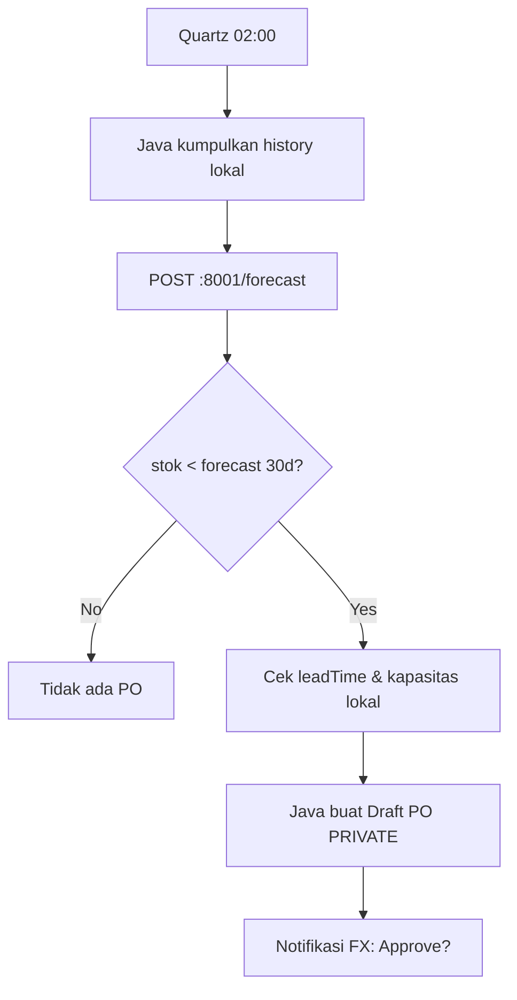

# SOSHA POS & INVENTORY MANAGEMENT SYSTEM
## VOLUME 10: ARTIFICIAL INTELLIGENCE - v2.0 Local Python Sidecar (Offline)

---

## 1. AI Philosophy (v2 vs v1)

**v1:** Cloud LLM + pgvector + Edge Functions (butuh internet, data ke OpenAI)
**v2:** **Local-First Intelligence** - Semua AI jalan di **Python FastAPI sidecar** (`localhost:8001`) tanpa internet, tanpa data keluar.

*   **Privacy Absolute:** Histori penjualan tidak pernah dikirim ke cloud LLM.
*   **Offline Capable:** Forecast & anomaly tetap jalan di hutan tanpa sinyal.
*   **Lightweight:** Model lokal kecil (Prophet, IsolationForest, sentence-transformers `all-MiniLM-L6-v2` ~80MB), tidak perlu GPU.
*   **Hybrid Optional:** Jika online & opt-in, bisa sync ke LLM cloud untuk RAG advanced, tapi default OFF.

### Pillars
1.  Demand Sensing Lokal (Prophet)
2.  Anomaly Detection Lokal (IsolationForest)
3.  Recommendation Lokal (Apriori + cosine similarity di SQLite/Chroma)
4.  NLQ Lokal (local LLM via Ollama opsional atau template SQL)

---

## 2. Stack (Local)

| Component | Tech | Why |
| :--- | :--- | :--- |
| **Runtime** | Python 3.11 bundled + FastAPI + Uvicorn | :8001 localhost, no auth |
| **Forecast** | Prophet (Facebook) + fallback ExponentialSmoothing (statsmodels) | Musiman retail, ringan |
| **Anomaly** | Scikit-learn IsolationForest + Z-score | Deteksi fraud/void |
| **Embeddings** | sentence-transformers `all-MiniLM-L6-v2` (local) | Rekomendasi semantic, no API key |
| **Vector Store** | Chroma (SQLite backend) atau `sqlite-vec` | Lokal, file `~/.sosha/vectors.db` |
| **RAG** | SQLite FTS + local prompt template (Ollama `mistral:7b-instruct` optional) | NLQ tanpa cloud |

Size total sidecar ~150MB (termasuk model), startup 2s, RAM 300MB.

---

## 3. Module 1: Inventory Forecasting (Local Prophet)

**Trigger:** Quartz Java `0 0 2 * * ?` (02:00) atau manual click "Forecast" di Finance -> Java panggil `POST :8001/api/v1/forecast`.

**Input**
```json
{"productId":"uuid","history":[{"date":"2026-07-01","qty":12},{"date":"2026-07-02","qty":15}],"leadTimeDays":7,"currentStock":40}
```

**Logic (Python)**
```python
from prophet import Prophet
df = pd.DataFrame(history).rename(columns={"date":"ds","qty":"y"})
m = Prophet(yearly_seasonality=True, weekly_seasonality=True)
m.fit(df)
future = m.make_future_dataframe(periods=30)
forecast = m.predict(future)
recommended = max(0, forecast.tail(7).yhat.sum() - currentStock + safetyStock)
```

**Output**
```json
{"forecast":[{"ds":"2026-09-01","yhat":18}],"recommendedPO":85,"mape":0.12}
```
Java simpan ke `purchase_drafts` lokal (PRIVATE, tidak sync), Manager approve manual.

**Fallback:** Jika Prophet gagal (data <30 rows), pakai `ExponentialSmoothing`.

---

## 4. Module 2: Sales Prediction (Local Dashboard)

Sequence sama: Java `DashboardService` -> `PythonClient.predictSales(branchId, last90Days)` -> Python hitung -> return vector -> Java render JavaFX `LineChart` (no Recharts).

---

## 5. Module 3: Recommendation (POS Upsell Lokal)

**Apriori Lokal**
*   Python baca `sale_items` dari Java via `GET :8001` payload atau Java kirim co-occurrence matrix.
*   Hitung `support(A->B) = P(A∩B)`, `confidence >0.6` -> suggest di POS sidebar JavaFX.

**Semantic**
```python
from sentence_transformers import SentenceTransformer
model = SentenceTransformer('all-MiniLM-L6-v2')
emb = model.encode(product.name) # lokal
# Chroma query: cosine similarity top 3
results = collection.query(query_embeddings=[emb], n_results=3)
```

**UI:** `RecommendationPane` JavaFX muncul "Pelanggan beli Kopi biasanya beli Gula" <100ms (cache).

---

## 6. Module 4: Sosha Assistant (Local NLQ)

**Tanpa Cloud LLM (Default):**
1. User ketik di JavaFX `SearchField`: "stok menipis minggu ini"
2. Java kirim `POST :8001/api/v1/rag/query {"query":"stok menipis minggu ini"}`
3. Python: embedding query -> Chroma search schema + keyword mapping -> generate SQL template:
   ```python
   # Rule-based NLQ (no LLM)
   if "stok menipis" in query: sql = "SELECT * FROM v_low_stock"
   elif "penjualan" in query: sql = "SELECT branch_id,sum(total) FROM sales GROUP BY branch_id"
   ```
4. Python execute via Java `GET /api/v1/query?sql=...` (read-only allowlist) -> return table JSON -> Java render TableView.

**Dengan Ollama (Optional, jika online & install):**
*   User install `ollama pull mistral:7b-instruct` -> Python `requests.post("http://localhost:11434/api/generate", ...)`
*   Prompt: `Hanya generate SELECT, jangan DELETE/UPDATE. Schema: ... Query: ...`
*   Guard: regex `^SELECT` only, deny `DROP/DELETE`.

---

## 7. Module 5: Anomaly Detection (Local IsolationForest)

| Anomaly | Logic Lokal | Action Java |
| :--- | :--- | :--- |
| Price Variance | `sale.total < cost*0.8` atau IsolationForest score < -0.5 | Popup confirm Manager |
| Ghost Inventory | `available>0 AND 0 sales 60d` | Notifikasi JavaFX `TrayNotification` |
| Void Fraud | `void_count >5/day` per cashier | `audit_log` + lock |

**Training:** Nightly `IsolationForest.fit(sales_features)` di Python (features: total, discount, void, hour).

---

## 8. Flowchart: Reordering Lokal



---

## 9. Risks & Privacy

1.  **Hallucination:** Template SQL allowlist + human approve PO -> mitigasi.
2.  **Data Privacy:** Tidak ada PII ke cloud; embedding lokal -> aman.
3.  **Resource:** Model 80MB-4GB (Ollama) -> cek RAM saat install, fallback rule-based jika <8GB.

---

## 10. Implementation Checklist

- [ ] `python-sidecar/app/main.py` FastAPI 3 endpoints + `/health`
- [ ] `requirements.txt`: fastapi, uvicorn, prophet, scikit-learn, pandas, sentence-transformers, chromadb
- [ ] `PythonManager.java` ProcessBuilder start `python/app/main.py` + watchdog
- [ ] `collection` Chroma init `~/.sosha/vectors.db`
- [ ] Java `ForecastService` -> `PythonClient` Retrofit
- [ ] JavaFX `ForecastChart` + `RecommendationPane`
- [ ] `scripts/download_models.py` pre-bundling embeddings
- [ ] Test: `pytest` forecast/anomaly, `mvn test -Dsidecar.mock`

---

## APPENDIX v2

*   **Chroma:** Embedded vector DB SQLite, no server.
*   **Ollama:** Local LLM runner, opsional.
*   **Prophet:** Additive time-series model.
*   **PRIVATE Data:** Tidak pernah dikirim ke sidecar? Justru sidecar lokal jadi aman - data tidak keluar PC.

## Final Recommendation v2

Mulai dengan **Rule-based NLQ + Prophet + IsolationForest** (ringan, offline). Jika user punya RAM 16GB+, tawarkan `ollama install` untuk NLQ LLM lokal yang lebih pintar. **Jangan default cloud LLM.**

---

**End of Volume 10 v2.0**

**End of Suite Sosha v2.0 Java+Python Offline-First**

### Architect Closing (v2)

Dokumentasi 11 Volume telah direwrite penuh ke **Java 21 + JavaFX + Spring Boot Embedded + Python FastAPI Sidecar + Dual-DB (SQLite/PostgreSQL) + Store Cloud Selective Sync**. Privasi admin terjamin (PRIVATE never sync), toko tetap online, dan user bebas pilih DB sesuai spek (ringan SQLite atau scalable PostgreSQL). Siap kickoff: `mvn verify -Psqlite,postgres` + `jpackage`.

**Ready for Build.**
