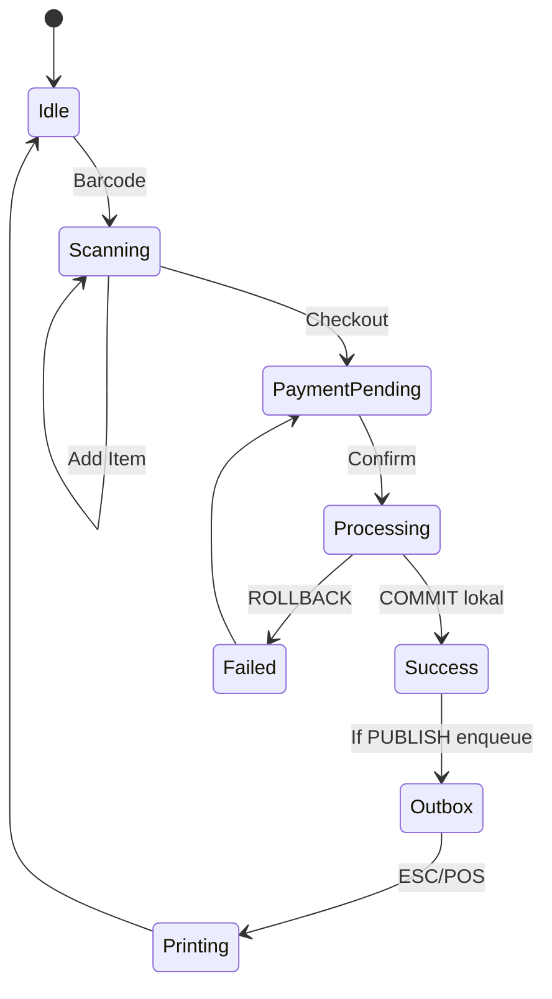

# SOSHA POS & INVENTORY MANAGEMENT SYSTEM
## VOLUME 2: SOFTWARE REQUIREMENT SPECIFICATION (SRS) - v2.0 Java+Python Offline-First

---

## 1. Introduction

### 1.1 Purpose
SRS v2 mendefinisikan kontrak teknis untuk **Sosha Desktop Offline** (Java 21 + JavaFX + Spring Boot Embedded) dengan **Python FastAPI sidecar** dan **Store Online Cloud** opsional. Fokus: offline ACID, privacy partition, dual-DB.

### 1.2 Scope
*   Desktop logic & UI (JavaFX)
*   Local DB (SQLite / PostgreSQL) dengan Flyway & JPA dialect abstraction
*   Python AI sidecar (localhost:8001)
*   Selective Sync Outbox ke Store Cloud (Spring Boot)
*   Hardware: ESC/POS, HID scanner, label printer

### 1.3 Definitions
*   **Dual-DB:** Satu codebase jalan di SQLite (file) atau PostgreSQL (server lokal)
*   **PRIVATE/PUBLIC:** `sync_policy` flag, PRIVATE never sync
*   **Outbox:** Tabel `sync_outbox` untuk reliable sync saat online
*   **Sidecar:** Proses Python berdampingan dengan Java via localhost

---

## 2. Overall Description

### 2.1 Product Perspective
**Desktop-First, Cloud-Optional.** Backend tidak terpisah; Spring Boot embedded di dalam JavaFX app. Cloud hanya untuk Store Online (katalog publish & order). Semua transaksi kritis terjadi di local DB.

### 2.2 Product Functions
1.  Identity Lokal (BCrypt, RBAC, JWT lokal tanpa cloud)
2.  Product Catalog (FTS lokal)
3.  Inventory (ACID lokal, FEFO/FIFO)
4.  POS (offline <50ms)
5.  Finance PRIVATE (tidak sync)
6.  Store Online Sync (selective)
7.  Intelligence Lokal (Python)

### 2.3 User Classes
| User Class | Access | DB Mode Rekomendasi |
| :--- | :--- | :--- |
| SuperAdmin | Full, migrasi DB | PG |
| Branch Manager | Audit, publish katalog | SQLite/PG |
| Cashier | POS only | SQLite |
| Warehouse | Stock in/out | SQLite |

### 2.4 Operating Environment
*   **OS:** Windows 10/11, Ubuntu 22+, macOS 13+ (jpackage MSI/DEB/DMG)
*   **Runtime:** JRE 21 (jlink stripped ~60MB) + Python 3.11 bundled
*   **DB:** SQLite 3.44+ (WAL) atau PostgreSQL 16 lokal
*   **Hardware:** HID scanner (USB), ESC/POS via USB/Serial (jSerialComm)

---

## 3. System Features

### 3.1 Multi-Tenant Lokal (Core) - FR-CORE-01
| Feature | Spec v2 |
| :--- | :--- |
| Tenant | Single tenant per desktop install (`tenant_id` default); multi-branch lokal |
| Isolasi | Hibernate @Filter `tenant_id`, bukan RLS cloud |
| Onboarding | Wizard install pilih DB + seed data |

### 3.2 Dual-DB Abstraction - FR-CORE-DB
*   **FR-DB-1:** App harus jalan identik di SQLite & PG via `application-sqlite.yml` / `application-postgres.yml`
*   **FR-DB-2:** Flyway migrations dialect-aware: `V1__init__sqlite.sql` vs `V1__init__postgres.sql` atau SQL common + dialect branch
*   **FR-DB-3:** Gunakan JPA, hindari native `RETURNING`, `ILIKE` tanpa fallback; gunakan `CriteriaBuilder`
*   **FR-DB-4:** Tool migrator `sqlite->postgres` tanpa loss: `pgloader` style dump

### 3.3 POS Offline - FR-POS-01
*   **FR-POS-1.1:** Search by SKU/barcode <50ms via FTS5 (SQLite) atau GIN (PG)
*   **FR-POS-1.2:** Pricing engine Java (Standard, Tiered, Flash Sale) - strategy pattern
*   **FR-POS-1.3:** Hold/Resume cart simpan ke `carts` table lokal
*   **FR-POS-1.4:** Payment offline split; outbox hanya jika item `is_published`

### 3.4 Inventory - FR-INV-01
*   **FR-INV-1.1:** Serial mandatory jika `is_serialized`
*   **FR-INV-1.2:** Batch/expiry FEFO + alert dari Python sidecar
*   **FR-INV-1.3:** Setiap movement -> `stock_ledger` dalam transaksi ACID yang sama

---

## 4. External Interface Requirements

### 4.1 UI
*   JavaFX 21 FXML + CSS, ControlsFX, virtualized TableView untuk 100k+ item
*   Hotkeys: F9 Pay, F2 Search, ESC Close
*   Theme Light/Dark via CSS

### 4.2 Hardware
*   **Scanner:** HID keyboard wedge -> JavaFX KeyEvent
*   **Receipt:** ESC/POS via `jSerialComm` / `javax.usb` -> direct byte stream
*   **Label:** ZPL via raw socket

### 4.3 Communication
*   **Internal:** Java <-> Python via `http://localhost:8001` (Retrofit/RestTemplate)
*   **External:** Java -> Store Cloud via `https://store.sosha.com/api/v1/*` (Outbox HTTP, exponential backoff)
*   **No WebSocket required** untuk lokal; UI update via JavaFX Properties

---

## 5. Non-Functional Requirements

### 5.1 Performance
*   **P1:** POS query <50ms di SQLite WAL & PG lokal (EXPLAIN QUERY PLAN / EXPLAIN ANALYZE)
*   **P2:** Startup <3s (splash + preload)
*   **P3:** 1M SKU di PG mode tanpa lag (pagination + virtualization); 100k SKU di SQLite

### 5.2 Security
*   **S1:** Password BCrypt, JWT lokal expiry 8 jam
*   **S2:** SQLite: SQLCipher AES-256, PG: pgcrypto + filesystem encryption (BitLocker/LUKS)
*   **S3:** PRIVATE data tidak pernah di-serialize ke outbox (enforced via `@SyncPolicy` annotation + test)

### 5.3 Reliability
*   **R1:** 30 hari offline tanpa degradasi
*   **R2:** Outbox retry dengan max 3, dead-letter table
*   **R3:** Python sidecar watchdog auto-restart jika crash

---

## 6. System State Diagram: POS Offline

---

## 7. Use Case: Adjustment Offline
| ID | UC-INV-02 |
| :--- | :--- |
| Actor | Warehouse Manager (offline) |
| Flow | 1. Pilih Adjustment 2. Scan SKU 3. Masuk Qty -5 4. Pilih Reason 5. Validate lokal 6. UPDATE `stock_levels` + INSERT `stock_ledger` dalam @Transactional |
| Post | Stok update lokal, outbox hanya jika produk publish |
| Exception | Jika <0 dan `allow_negative=false` -> throw `InsufficientStockException` |

---

## 8. Data Integrity
| Field | Validation |
| :--- | :--- |
| `price` | `@DecimalMin("0.00")` + CHECK |
| `sku` | Unique per tenant (index) |
| `expiry_date` | > today |
| `qty` | scale 3, trigger FEFO |

Dialect handling: `CHECK` sama di kedua DB; `AUTOINCREMENT` SQLite vs `BIGSERIAL` PG di-abstract via JPA `@GeneratedValue`.

---

## 9. Implementation Checklist
- [ ] Spring Boot 3.3 + JavaFX 21 skeleton + `application-{sqlite,postgres}.yml`
- [ ] Hibernate dialects: `SQLiteDialect` custom + `PostgreSQLDialect`
- [ ] Flyway dual migrations
- [ ] Python sidecar FastAPI `app/main.py` + `/health`
- [ ] Outbox table + Quartz poller
- [ ] PricingEngine unit tests

## 10. Best Practices & Risks
*   **Avoid Vendor Lock:** Jangan pakai `ON CONFLICT` PG tanpa fallback SQLite `INSERT OR REPLACE`
*   **Concurrency:** SQLite `maxPool=1`, WAL mode; PG `maxPool=20`
*   **Risk Mitigation:** Transaksi pendek, optimistic lock `@Version`

**End of Volume 2 v2.0**
