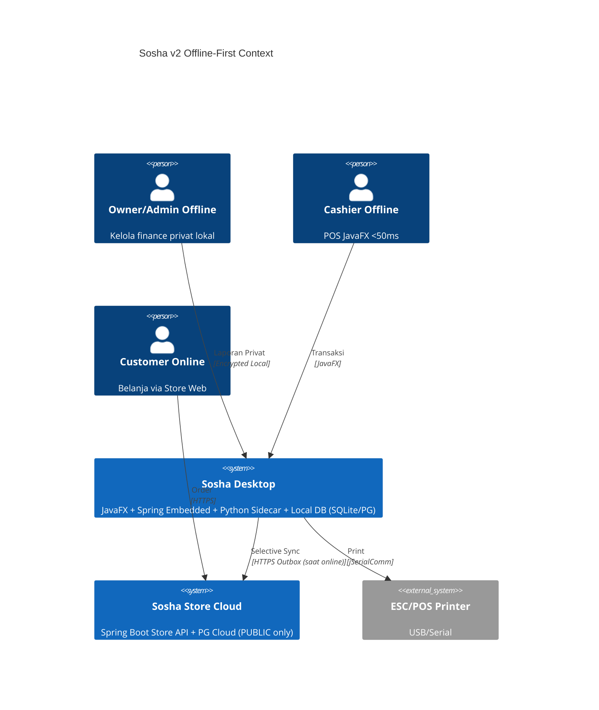
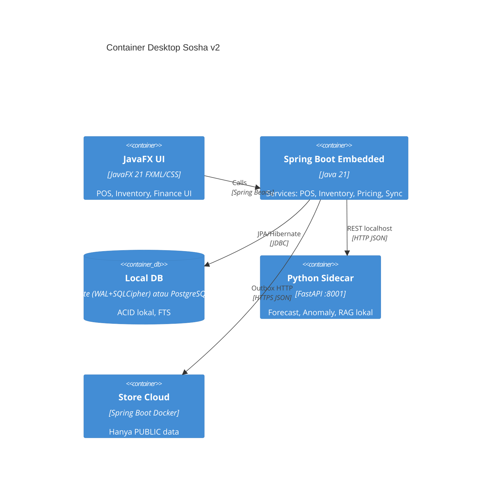

# SOSHA POS & INVENTORY MANAGEMENT SYSTEM
## VOLUME 3: SYSTEM ARCHITECTURE - v2.0 Java+Python Offline-First

---

## 1. Architectural Philosophy
Sosha v2 membuang **Serverless Cloud** dan mengganti dengan **Desktop-Native Hybrid**. Prinsip: **Compute Lokal, Sync Selektif, Privacy Absolute**.

1.  **Offline-First Embedded:** Spring Boot jalan di dalam JavaFX app (no external server), semua transaksi ACID lokal.
2.  **Privacy Partition:** `sync_policy=PRIVATE` tidak pernah keluar device (enforced di code + DB trigger).
3.  **Dual-DB Adaptive:** Satu codebase via JPA Dialect - SQLite (WAL, 1 file) untuk spek rendah, PostgreSQL lokal untuk scale.
4.  **Python Sidecar:** AI lokal (FastAPI :8001) tanpa internet, komunikasi localhost.
5.  **Store Online Optional:** Spring Boot Cloud hanya untuk katalog publish & order.

---

## 2. C4 Model - Level 1: System Context (v2)



---

## 3. C4 Model - Level 2: Container Diagram (Desktop Internals)



### Pemilihan DB via Profile
```properties
# application-sqlite.yml
spring.datasource.url=jdbc:sqlite:sosha.db?cipher=aes256
spring.jpa.properties.hibernate.dialect=com.sosha.db.SQLiteDialect
hikari.maximum-pool-size=1

# application-postgres.yml
spring.datasource.url=jdbc:postgresql://localhost:5432/sosha
spring.jpa.properties.hibernate.dialect=org.hibernate.dialect.PostgreSQLDialect
hikari.maximum-pool-size=20
```

---

## 4. C4 Model - Level 3: Component (POS Module)

| Component | Responsibility | Implementation |
| :--- | :--- | :--- |
| **PricingEngine** | Hitung total, pajak, diskon tiered | Java Strategy Pattern, BigDecimal |
| **InventoryManager** | Validasi stok, FEFO, lock row | JPA @Transactional + `SELECT FOR UPDATE` (PG) / `BEGIN IMMEDIATE` (SQLite) |
| **OutboxEnqueuer** | Tentukan perlu sync ke cloud? | Check `is_published && sync_policy=PUBLIC` |
| **PythonClient** | Forecast & anomaly | Retrofit ke localhost:8001 |
| **PrintService** | ESC/POS | jSerialComm byte stream |

---

## 5. Deployment Architecture (Desktop + Cloud)

```mermaid
deployment
    title Sosha v2 Deployment

    deploymentNode(desktopPC, "User PC", "Win/Mac/Linux") {
        node(jre, "JRE 21 jlink (~60MB)")
        node(app, "Sosha Desktop (jpackage)")
        node(pySide, "Python 3.11 bundled (~40MB)")
        node(dbNode, "SQLite sosha.db atau PG lokal")
    }
    deploymentNode(vps, "VPS Docker", "Store Cloud") {
        node(storeApi, "store-cloud.jar")
        node(pgCloud, "PostgreSQL Cloud (PUBLIC)")
    }
    Rel(app, dbNode, "JPA", "JDBC")
    Rel(app, pySide, "HTTP", "localhost:8001")
    Rel(app, storeApi, "Sync", "HTTPS Outbox")
```

---

## 6. Security Architecture: Privacy Partition

### 6.1 Triple Layer
1.  **Auth Lokal:** BCrypt + JWT lokal (8 jam), RBAC (`ADMIN/MANAGER/CASHIER`)
2.  **Encryption At Rest:** SQLite SQLCipher AES-256-GCM, PG pgcrypto + OS disk encrypt
3.  **Sync Firewall:** `@SyncPolicy` annotation + DB trigger `BEFORE INSERT ON sync_outbox CHECK (sync_policy='PUBLIC')` + audit test

### 6.2 Contoh Entity
```java
@Entity
@SyncPolicy(SyncPolicy.PUBLIC) // hanya ini boleh sync
public class Product { boolean isPublished; ... }

@Entity
@SyncPolicy(SyncPolicy.PRIVATE) // never sync
public class FinanceLedger { BigDecimal profit; ... }
```

### 6.3 Audit Log Lokal
```sql
-- SQLite & PG sama via JPA
CREATE TABLE audit_log (id TEXT PK, table_name TEXT, row_id TEXT, op TEXT, old_json TEXT, new_json TEXT, user_id TEXT, ts DATETIME);
-- Trigger via Flyway
```

---

## 7. Sequence Diagram: Sale Offline + Selective Sync

```mermaid
sequenceDiagram
    participant C as Cashier
    participant FX as JavaFX
    participant SB as Spring Service
    participant DB as Local DB
    participant OB as Outbox
    participant PY as Python
    participant SC as Store Cloud

    C->>FX: Scan Barcode
    FX->>SB: addItem(sku)
    SB->>DB: SELECT stock FOR UPDATE
    SB->>PY: POST /anomaly/check (optional)
    PY-->>SB: OK
    C->>FX: Pay
    FX->>SB: checkout()
    SB->>DB: BEGIN; INSERT sale; UPDATE stock; INSERT ledger; COMMIT
    SB->>OB: if product.isPublished then enqueue delta
    SB->>FX: Print ESC/POS
    Note over OB,SC: Saat Online - Quartz Poller
    OB->>SC: POST /api/v1/stock-publish
    SC-->>OB: 200
    OB->>DB: mark synced
```

---

## 8. Infrastructure Best Practices

### 8.1 DB Scaling
*   **SQLite Mode:** WAL=ON, `PRAGMA journal_mode=WAL`, `synchronous=NORMAL`, backup via file copy
*   **PG Mode:** Read heavy via local replica opsional, `VACUUM` auto, partition `stock_ledger` by month
*   **Index:** `CREATE INDEX idx_sku ON products(sku)` + FTS5 (SQLite) / `GIN(to_tsvector)` (PG)

### 8.2 Sync Optimization
*   Batch outbox 50 rows per push, Gzip, idempotencyKey UUID
*   Pull order dari cloud via `GET /orders?since=lastSyncTs`

---

## 9. Risk Analysis

| Risk | Prob | Impact | Mitigasi |
| :--- | :--- | :--- | :--- |
| Dialect Drift SQLite/PG | Med | High | Test matrix CI: `mvn test -Psqlite,postgres` |
| SQLite Write Lock | Med | Med | Hikari maxPool 1, queue write, PG untuk heavy concurrent |
| Sidecar Crash | Low | Med | Watchdog thread + healthcheck |
| Privacy Leak | Low | Critical | Compile-time annotation processor + negative test |

---

## 10. Checklist

- [ ] Wizard pilih DB (SQLite default)
- [ ] Flyway migrations dual dialect
- [ ] Python sidecar bundled
- [ ] Outbox + Quartz + StoreClient
- [ ] ESC/POS & HID tested
- [ ] Audit log trigger

**End of Volume 3 v2.0**

**Waiting for VOLUME 4 Database Design Dual-DB**
