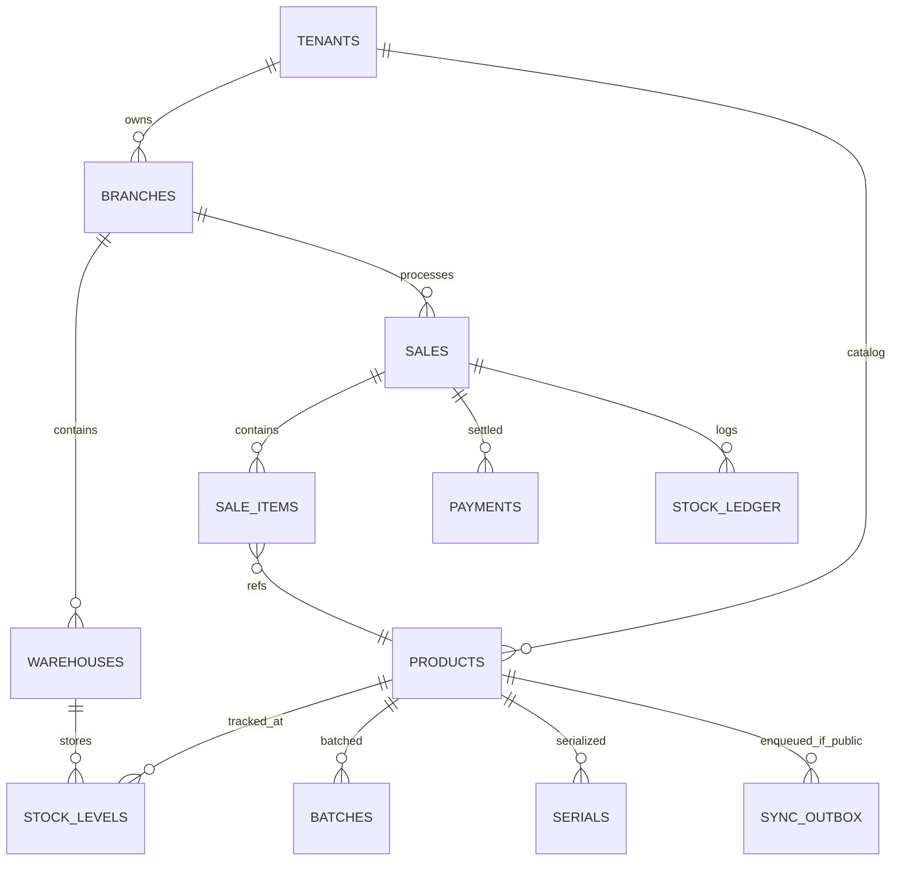

# SOSHA POS & INVENTORY MANAGEMENT SYSTEM
## VOLUME 4: DATABASE DESIGN - v2.0 Dual-DB (SQLite / PostgreSQL)

---

## 1. Introduction
Sosha v2 menggunakan **Dual-Mode Local Database**: **SQLite (SQLCipher)** untuk ringan dan **PostgreSQL 16** untuk scale. Satu codebase JPA/Hibernate dengan `Dialect` abstraction + Flyway migrations dialect-aware. Semua data ACID lokal. Selective sync via `sync_outbox` hanya untuk `PUBLIC`.

**Prinsip:** Offline ACID, Privacy Partition (`sync_policy`), Adaptive Scalability.

---

## 2. ERD (Sama untuk kedua DB, tambah Sync)



---

## 3. Data Dictionary

### 3.1 Infrastructure

**tenants**
| Column | Type (Common) | Note |
| :--- | :--- | :--- |
| `id` | TEXT UUID | PK, `uuid_generate_v4()` PG / `uuid()` SQLite |
| `name` | VARCHAR(255) | NOT NULL |
| `slug` | VARCHAR(100) | UNIQUE |
| `currency_code` | CHAR(3) | DEFAULT 'IDR' |
| `settings_json` | TEXT JSON | JSON TEXT (PG JSONB, SQLite TEXT) |
| `created_at` | TIMESTAMP | |

**branches** + `tenant_id` FK, `name`, `location`, `is_active` BOOLEAN (PG boolean, SQLite INTEGER 0/1)

### 3.2 Product Catalog

**products**
| Column | Type | Constraints | Sync |
| :--- | :--- | :--- | :--- |
| `id` | TEXT UUID PK | | PUBLIC if `is_published` |
| `tenant_id` | TEXT FK | | |
| `sku` | VARCHAR(100) | UNIQUE per tenant | |
| `barcode` | VARCHAR(100) | INDEX | |
| `name` | VARCHAR(255) | NOT NULL, FTS | |
| `uom_id` | TEXT FK | | |
| `is_serialized` | BOOLEAN | | |
| `is_batched` | BOOLEAN | | |
| `base_price` | NUMERIC(15,2) | CHECK >=0 | |
| `attributes_json` | TEXT | JSON | |
| `is_published` | BOOLEAN | DEFAULT FALSE | Menentukan masuk outbox? |
| `sync_policy` | VARCHAR(10) | `PUBLIC`/`PRIVATE` DEFAULT PUBLIC | **PRIVATE never sync** |
| `deleted_at` | TIMESTAMP | NULL = active | |

### 3.3 Inventory

**stock_levels**
| Column | Type | Note |
| :--- | :--- | :--- |
| `id` | BIGINT PK | PG BIGSERIAL, SQLite INTEGER AUTOINCREMENT |
| `product_id` | TEXT FK | |
| `warehouse_id` | TEXT FK | |
| `available_qty` | NUMERIC(15,3) | DEFAULT 0 |
| `reserved_qty` | NUMERIC(15,3) | |
| `min_stock_level` | NUMERIC(15,3) | |

**stock_ledger** (audit)
| Column | Type |
| :--- | :--- |
| `id` | TEXT UUID PK |
| `product_id` | TEXT FK |
| `warehouse_id` | TEXT FK |
| `change_qty` | NUMERIC |
| `reference_type` | VARCHAR(50) SALE/PURCHASE/ADJUSTMENT/TRANSFER |
| `reference_id` | TEXT |
| `created_at` | TIMESTAMP |
| `user_id` | TEXT |

**sync_outbox** (kunci selective sync)
| Column | Type | Note |
| :--- | :--- | :--- |
| `id` | TEXT UUID PK | |
| `table_name` | VARCHAR(50) | e.g., products, stock_levels |
| `row_id` | TEXT | PK row sumber |
| `op` | VARCHAR(10) | INSERT/UPDATE/DELETE |
| `payload_json` | TEXT | JSON snapshot (hanya PUBLIC) |
| `idempotency_key` | TEXT UNIQUE | UUID |
| `created_at` | TIMESTAMP | |
| `synced_at` | TIMESTAMP NULL | NULL = pending |
| `retry_count` | INTEGER | max 3 |

> **Trigger Guard:** `BEFORE INSERT ON sync_outbox` -> cek `sync_policy='PUBLIC'` else REJECT. Test `PRIVATE` tidak pernah masuk.

### 3.4 Sales
**sales** + **sale_items** + **payments** mirip v1, tambah `sync_policy` dan `is_published` di sales jika perlu sync order online (default PRIVATE untuk offline sale, PUBLIC untuk order publish).

---

## 4. Dual-DB Dialect Strategy

| Aspek | SQLite | PostgreSQL |
| :--- | :--- | :--- |
| **UUID** | `TEXT` + `uuid()` via Java | `UUID` native |
| **AutoInc** | `INTEGER PRIMARY KEY AUTOINCREMENT` | `BIGSERIAL` / `GENERATED AS IDENTITY` |
| **Boolean** | `INTEGER 0/1` (Hibernate map) | `BOOLEAN` |
| **JSON** | `TEXT` + `json_extract()` | `JSONB` + `->>` |
| **FTS** | `FTS5` virtual table `products_fts` | `GIN(to_tsvector)` |
| **Upsert** | `INSERT OR REPLACE` | `ON CONFLICT DO UPDATE` -> Hibernate abstrak via `merge()` |
| **Timestamp** | `TEXT ISO8601` | `TIMESTAMPTZ` |
| **Encrypted** | SQLCipher `PRAGMA key` AES-256 | pgcrypto + LUKS/BitLocker |
| **Pool** | Hikari maxPool 1, WAL ON | Hikari maxPool 20 |

**Flyway Layout**
```
resources/db/migration/
  common/V1__core.sql
  sqlite/V1_1__fts5.sql
  postgres/V1_1__gin.sql
```
Atau `V1__init__sqlite.sql` / `V1__init__postgres.sql` via `flyway.locations=classpath:db/migration/common,classpath:db/migration/{dialect}`

**JPA Abstraction**
```java
@Entity @Table(name="products")
public class Product {
  @Id String id;
  @Column String sku;
  @Column(columnDefinition="TEXT") String attributesJson; // both
}
```

---

## 5. Indexes & FTS

**Common**
```sql
CREATE UNIQUE INDEX idx_sku_tenant ON products(tenant_id, sku);
CREATE INDEX idx_sales_tenant_branch ON sales(tenant_id, branch_id);
CREATE INDEX idx_stock_product_wh ON stock_levels(product_id, warehouse_id);
```

**SQLite FTS5**
```sql
CREATE VIRTUAL TABLE products_fts USING fts5(name, sku, content='products', content_rowid='rowid');
CREATE TRIGGER trg_products_ai AFTER INSERT ON products BEGIN INSERT INTO products_fts(rowid,name,sku) VALUES (new.rowid,new.name,new.sku); END;
-- Query: SELECT * FROM products JOIN products_fts ON products.rowid=products_fts.rowid WHERE products_fts MATCH 'kopi*';
```

**PostgreSQL GIN**
```sql
CREATE INDEX idx_products_name_gin ON products USING gin(to_tsvector('english', name));
-- Query: SELECT * FROM products WHERE to_tsvector('english', name) @@ plainto_tsquery('kopi');
```
App gunakan `ProductRepository.search(query)` dengan branch dialect.

---

## 6. Triggers & ACID (Local)

**Stock Decrement** via Java `@Transactional` Service (bukan DB trigger hard):
```java
@Transactional
public Sale checkout(Cart cart) {
  saleRepository.save(sale);
  for(Item i: cart) {
    StockLevel sl = em.find(StockLevel.class, i.productId, LockModeType.PESSIMISTIC_WRITE);
    if(sl.availableQty < i.qty && !allowNegative) throw new InsufficientStockException();
    sl.availableQty -= i.qty;
    ledgerRepository.save(new StockLedger(...));
    if(product.isPublished) outboxRepository.enqueue("stock_levels", sl.id, sl.toJson());
  }
}
```
Untuk PG: `SELECT FOR UPDATE`. Untuk SQLite: `BEGIN IMMEDIATE` + `maxPool=1` menjamin serial.

**Audit Log** via Hibernate `EntityListeners` atau Flyway trigger both DB.

---

## 7. Security: Application-Level Tenant Filter (menggantikan RLS)

RLS Supabase diganti `@TenantFilter` Hibernate:
```java
@FilterDef(name="tenantFilter", parameters=@ParamDef(name="tenantId", type=String.class))
@Filter(name="tenantFilter", condition="tenant_id = :tenantId")
public class Product { ... }

em.enableFilter("tenantFilter").setParameter("tenantId", currentUser.tenantId);
```
Plus `CHECK` constraint `sync_policy IN ('PUBLIC','PRIVATE')`.

---

## 8. Views (Materialized lokal via scheduled refresh)

**v_low_stock**
```sql
CREATE VIEW v_low_stock AS
SELECT p.sku,p.name,w.name as wh, sl.available_qty, sl.min_stock_level
FROM stock_levels sl JOIN products p ON sl.product_id=p.id JOIN warehouses w ON sl.warehouse_id=w.id
WHERE sl.available_qty <= sl.min_stock_level;
```
Python sidecar query view ini untuk forecast.

---

## 9. Migrasi & Pilihan User

**Wizard Install**
1. Cek RAM/CPU: rekomendasi SQLite jika <4GB atau <100k SKU
2. User pilih -> `application.yml` set `spring.profiles.active=sqlite|postgres`
3. Flyway migrate otomatis
4. Tool migrasi: `java -jar sosha-migrator.jar --from sqlite --to postgres` (dump SQLite -> COPY ke PG)

**Backup**
*   SQLite: copy `sosha.db` + `sosha.db-wal` (atomic)
*   PG: `pg_dump` lokal

---

## 10. Risks

| Risk | Mitigasi |
| :--- | :--- |
| Deadlock | SQLite serial, PG sort product_id |
| Large ledger | Partition per month (PG native, SQLite manual table `ledger_2026_08`) |
| FTS divergence | Test both dialects CI matrix |

## 11. Checklist
- [ ] Flyway common + dialect
- [ ] SQLCipher key setup (SQLite) / pgcrypto (PG)
- [ ] Outbox table + guard trigger
- [ ] FTS5 & GIN indexes
- [ ] Tenant filter enabled

**End of Volume 4 v2.0**
