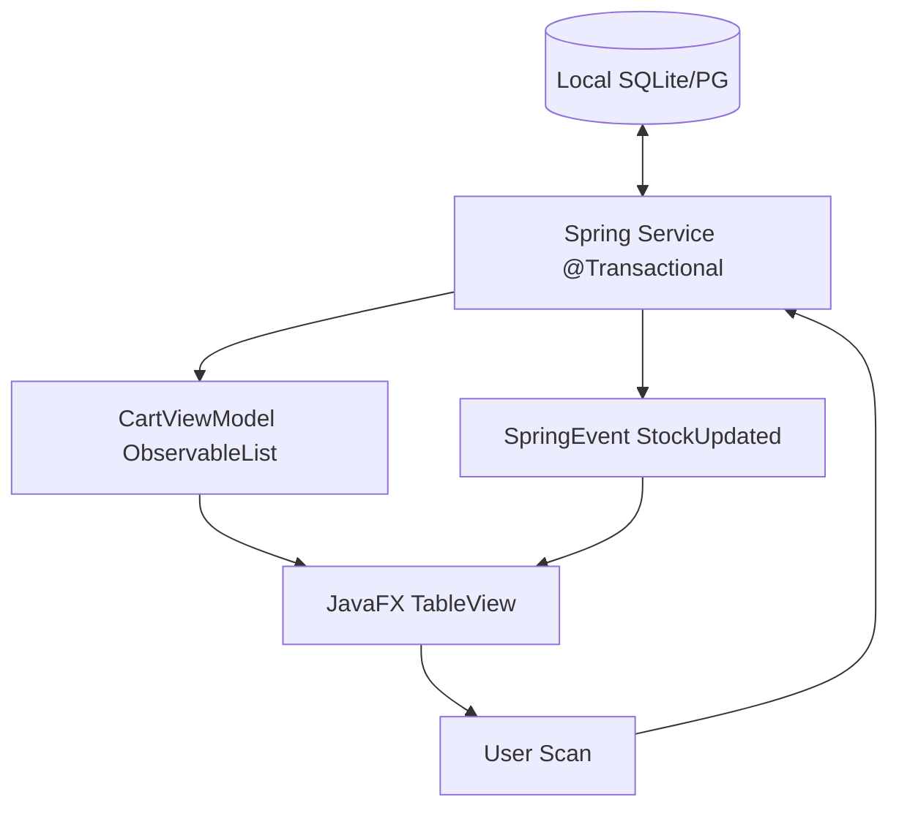
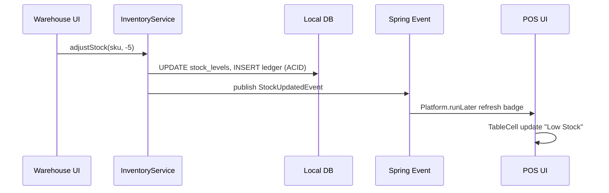

# SOSHA POS & INVENTORY MANAGEMENT SYSTEM
## VOLUME 6: FRONTEND ARCHITECTURE - v2.0 JavaFX Enterprise Desktop

---

## 1. Philosophy
Frontend v2 bukan React/PWA lagi, melainkan **JavaFX 21 Native Desktop**. Prinsip: **Pixel-Perfect Offline, Sub-50ms Interaction, Privacy-First**.

1.  **Native Desktop:** Tidak bergantung browser, Service Worker, IndexedDB. Semua state di heap + local DB.
2.  **Embedded Spring:** JavaFX Controllers adalah Spring `@Component` (DI via Spring), bukan manual new.
3.  **Reactive Properties:** `ObjectProperty`, `ObservableList` + Spring Events untuk sync UI tanpa polling.
4.  **Offline is Default:** Tidak ada loading spinner cloud; semua data dari heap/DB lokal.

---

## 2. Stack Justification

| Tech | Role | Why |
| :--- | :--- | :--- |
| **JavaFX 21** | UI Toolkit | Hardware-accelerated, FXML declarative, true desktop (ESC/POS direct) |
| **FXML + CSS** | Layout | Separation view/controller, theming dark/light via CSS |
| **ControlsFX** | Widgets | AutoComplete, Notification, BreadCrumb enterprise |
| **Spring Boot 3.3** | DI & Services | In-process service layer, @Transactional, JPA |
| **Hibernate JPA** | ORM | Dialect abstraction SQLite/PG |
| **TestFX** | UI Test | Headless UI testing |
| **JFoenix / MaterialFX** | Material Design | Modern look |

> **Mengapa bukan Electron/React?** Startup ~1s vs 5s, RAM 150MB vs 400MB, akses hardware native tanpa WebUSB hack.

---

## 3. Folder Structure (Feature-Based)

```
desktop/src/main/java/com/sosha/
├── SoshaApp.java              # extends Application, launch Spring + FX
├── SoshaSpringApp.java        # @SpringBootApplication
├── ui/
│   ├── MainController.java    # Shell (menu, branch selector)
│   ├── pos/
│   │   ├── PosController.java
│   │   ├── CartViewModel.java # ObservableList<CartItem>
│   │   └── ReceiptPrinterService.java
│   ├── inventory/
│   ├── finance/               # PRIVATE - no sync code
│   ├── settings/
│   │   └── DbSelectorController.java # SQLite vs PG wizard
│   └── common/
│       ├── DataTable.java     # Virtualized TableView
│       └── SearchField.java   # FTS search
├── core/
│   ├── service/               # PricingService, InventoryService
│   ├── repository/            # JPA Repositories
│   ├── sync/                  # OutboxEnqueuer, SyncScheduler
│   └── security/              # AuthService, TenantFilter
├── resources/
│   ├── fxml/pos.fxml, inventory.fxml
│   ├── css/light.css, dark.css
│   ├── db/migration/          # Flyway
│   └── python/                # bundled sidecar
```

---

## 4. State Management Strategy (v2 vs React)

**v1:** TanStack Query + Zustand (cloud)
**v2:** JavaFX Properties + Spring ApplicationEvent (local)



**Contoh ViewModel**
```java
@Component @Scope("prototype")
public class CartViewModel {
  private final ObservableList<CartItem> items = FXCollections.observableArrayList();
  private final ObjectProperty<BigDecimal> total = new SimpleObjectProperty<>(BigDecimal.ZERO);
  public void addItem(Product p) {
    items.add(new CartItem(p, 1));
    total.set(items.stream().map(CartItem::subtotal).reduce(BigDecimal.ZERO, BigDecimal::add));
  }
}
```

**Spring -> FX Thread**
```java
Platform.runLater(() -> cartViewModel.refresh(stockUpdatedEvent));
```

---

## 5. UI Component Hierarchy (POS)

*   **MainStage (BorderPane)**
    *   **Top:** BranchLabel, SyncStatus (Online/Offline dot), User
    *   **Center:** SplitPane
        *   Left: `SearchField` (FTS, autocomplete, barcode listener) + `ProductGrid` (FlowPane virtualized, 50 per page)
        *   Right: `CartTable` (TableView virtualized) + `SummaryPane` (tax/discount) + `PayButtons` (Cash, Split)
    *   **Bottom:** Hotkey hints (F9 Pay, F2 Focus Search)

---

## 6. Sequence: Stock Update Lokal (tanpa Realtime Cloud)



---

## 7. Offline-First Desktop Strategy (Menggantikan PWA)

| Layer | v1 (PWA) | v2 (Desktop) |
| :--- | :--- | :--- |
| Shell Cache | Service Worker | Native JAR (no cache needed) |
| Data | IndexedDB Dexie | SQLite/SQLCipher atau PG lokal |
| Sync | Background Sync | Quartz Outbox Poller (saat online) |
| Install | Manifest | jpackage MSI/DEB/DMG native |

**Online Detection**
```java
ScheduledExecutorService.checkConnectivity("https://store.sosha.com/health", 5s)
  -> toggle onlineDot + trigger SyncScheduler.flushOutbox()
```

---

## 8. Design System & Accessibility

| Category | Standard |
| :--- | :--- |
| Contrast | WCAG AA 4.5:1, CSS variables |
| Typography | Inter via FX CSS `-fx-font-family` |
| Dark Mode | `scene.getStylesheets().set(dark.css)` toggle |
| Keyboard | Accelerators `F9`, `F2`, `ESC`, full Tab nav |
| Touch | Min 48x48 button, TableView row 44px |

---

## 9. Performance Best Practices

1.  **Virtualization:** `TableView` + `FlowPane` pagination (50), tidak load 10k sekaligus
2.  **Lazy FXML:** `FXMLLoader.load()` per tab on-demand
3.  **Image:** Thumbnail 128px cache di `~/.sosha/cache`, lazy load
4.  **Memoization:** `FilteredList` + `SortedList` untuk search, debounce 150ms
5.  **Threading:** `Task<V>` untuk DB heavy, jangan block FX thread

---

## 10. Implementation Checklist

- [ ] `SoshaApp extends Application` + `SpringApplicationBuilder` hybrid
- [ ] `DbSelectorController` wizard SQLite/PG + Flyway
- [ ] `PosController` + `CartViewModel` + HID barcode handler
- [ ] `DataTable` virtualized + FTS search
- [ ] Dark/Light CSS + hotkeys
- [ ] TestFX smoke tests

## 11. Risks

| Risk | Impact | Mitigasi |
| :--- | :--- | :--- |
| FX Thread Block | High | Pakai `Task` untuk DB |
| Bundle Bloat | Med | jlink strip |
| FXML Memory | Low | Unload tab saat hidden |

**End of Volume 6 v2.0**

**Next: VOLUME 7 Backend (Spring Embedded + Python)**
