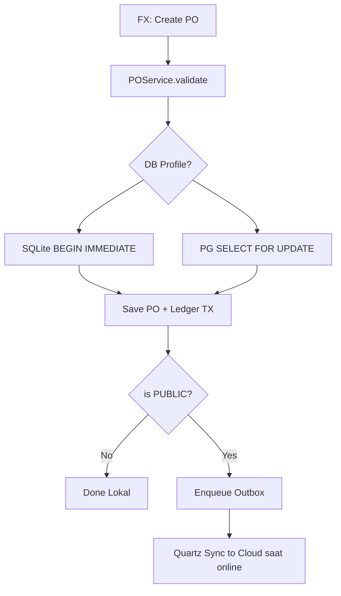

# SOSHA POS & INVENTORY MANAGEMENT SYSTEM
## VOLUME 7: BACKEND ARCHITECTURE - v2.0 Spring Boot Embedded + Python Sidecar

---

## 1. Philosophy
Backend v2 dibalik: **Database-First tetap, tapi Serverless diganti Embedded**. Tidak ada Deno Edge Functions. Semua logic jalan di **Spring Boot Embedded** di dalam Desktop (in-process). Python sidecar hanya untuk AI.

1.  **Atomic Lokal:** `@Transactional` JPA, ACID SQLite (WAL) / PG.
2.  **In-Process:** Tidak ada network hop untuk transaksi; <1ms service call.
3.  **Selective Edge:** Hanya Store Cloud (Docker Spring Boot) yang jadi "edge" untuk e-commerce.
4.  **Policy Enforcement:** `@SyncPolicy` annotation + DB CHECK, bukan RLS cloud.

---

## 2. Stack Justification

| Component | Tech | Why |
| :--- | :--- | :--- |
| **Compute** | Spring Boot 3.3 Embedded (Java 21) | In-process, no cold start, DI, AOP, Tx |
| **ORM** | Hibernate 6 + JPA | Dialect SQLite/PG, lazy load |
| **DB** | SQLite 3.44 WAL+SQLCipher / PG 16 | Pilihan user, file vs server |
| **Migration** | Flyway 10 | Dialect-aware migrations |
| **Pool** | HikariCP | 1 untuk SQLite, 20 untuk PG |
| **AI Sidecar** | FastAPI + Uvicorn (Python 3.11) | Forecast, anomaly, RAG lokal |
| **HTTP Client** | Retrofit2 + OkHttp | Ke Python localhost & Store Cloud |
| **Scheduler** | Quartz | Outbox poller & Python healthcheck |
| **Store Cloud** | Spring Boot Docker | Hanya PUBLIC data |

---

## 3. Folder Structure

```
desktop/src/main/java/com/sosha/
├── config/
│   ├── DataSourceConfig.java  # profile sqlite/postgres
│   ├── JpaConfig.java
│   └── SyncConfig.java
├── core/
│   ├── domain/                # @Entity Product, Sale, StockLevel
│   ├── repository/            # JpaRepository
│   ├── service/
│   │   ├── PricingService.java
│   │   ├── InventoryService.java
│   │   ├── SaleService.java   # @Transactional checkout
│   │   └── FinanceService.java # PRIVATE
│   ├── sync/
│   │   ├── Outbox.java        # @Entity
│   │   ├── OutboxRepository.java
│   │   ├── OutboxEnqueuer.java # if PUBLIC then enqueue
│   │   ├── SyncScheduler.java  # Quartz every 5s if online
│   │   └── StoreClient.java    # Retrofit to Store Cloud
│   ├── python/
│   │   ├── PythonManager.java  # ProcessBuilder start/stop
│   │   └── PythonClient.java   # Retrofit :8001
│   └── security/
│       ├── AuthService.java    # BCrypt
│       └── TenantFilter.java   # Hibernate Filter
├── ui/                        # JavaFX Controllers (Spring beans)
└── SoshaApp.java

python-sidecar/app/
├── main.py                    # FastAPI app
├── forecast/prophet_service.py
├── anomaly/isolation.py
└── rag/local_vector.py        # Chroma + sentence-transformers

store-cloud/
├── src/main/java/com/sosha/store/
│   ├── StoreApplication.java
│   ├── catalog/               # PUBLIC only
│   └── order/
└── Dockerfile
```

---

## 4. Layered Architecture

```
JavaFX Controller -> Service (@Transactional) -> Repository (JPA) -> DB (SQLite/PG)
                              |
                              -> OutboxEnqueuer (if PUBLIC)
                              -> PythonClient (async, timeout 2s, fallback)
                              -> Spring ApplicationEvent (UI refresh)
```

**SaleService**
```java
@Service
public class SaleService {
  @Transactional
  public Sale checkout(CheckoutCmd cmd) {
    Sale sale = new Sale(cmd.idempotencyKey());
    saleRepository.save(sale);
    for(Line l: cmd.items()){
      StockLevel sl = stockRepo.findForUpdate(l.productId(), l.warehouseId());
      if(sl.getAvailable().compareTo(l.qty())<0 && !l.allowNegative()) throw new InsufficientStockException();
      sl.setAvailable(sl.getAvailable().subtract(l.qty()));
      ledgerRepo.save(new StockLedger(l.productId(), l.qty().negate(), "SALE", sale.getId()));
      if(l.product().isPublished()) outboxEnqueuer.enqueue("stock_levels", sl.getId(), sl.toJson());
      if(l.product().isPublished()) outboxEnqueuer.enqueue("sales", sale.getId(), sale.toJsonPublic());
    }
    eventPublisher.publishEvent(new SaleCompletedEvent(sale));
    pythonClient.anomalyCheckAsync(sale); // fire & forget
    return sale;
  }
}
```

**Dialect Handling:** No `RETURNING` native; use `saveAndFlush()` + JPA.

---

## 5. Workflow: Purchase Order



---

## 6. Real-time & Caching (Lokal)

| Channel | Mechanism | Use |
| :--- | :--- | :--- |
| `StockUpdated` | Spring `ApplicationEvent` + `Platform.runLater` | Refresh POS badge |
| `SaleCompleted` | Event | Manager dashboard live |
| Cache | Caffeine (in-heap) 5min untuk product catalog | Kurangi DB hit |
| Python | HTTP localhost | Forecast cache di Python memory |

Tidak ada WebSocket cloud untuk desktop.

---

## 7. Storage

| Bucket | Lokasi | Akses |
| :--- | :--- | :--- |
| `product-media` | `~/.sosha/media/` lokal + optional sync PUBLIC ke cloud S3 | FileSystem |
| `invoice-vault` | `~/.sosha/invoices/` terenkripsi | PRIVATE, no sync |
| `tenant-assets` | lokal | - |

---

## 8. Error & Logging
*   Global: `@ControllerAdvice` untuk REST lokal, `UncaughtExceptionHandler` untuk FX
*   Audit: Hibernate `Interceptor` -> `audit_log` lokal
*   Monitoring Lokal: Logback file `~/.sosha/logs/sosha.log` + Sentry opsional (hanya jika online & opt-in)
*   Python logs: `~/.sosha/logs/python.log`

---

## 9. Sequence: Multi-Currency Offline

```mermaid
sequenceDiagram
    participant FX as FX
    participant S as SaleService
    participant PY as Python
    participant DB as Local DB

    FX->>S: checkout EUR 100
    S->>PY: GET /currency/rate?from=EUR&to=IDR
    PY-->>S: 17200 (cached offline)
    S->>DB: BEGIN; save sale (IDR+EUR); decrement; COMMIT
    S-->>FX: success
```

Kurs di-cache Python (ECB snapshot), update saat online.

---

## 10. Best Practices

1.  Idempotency: `idempotency_key` UNIQUE di sales + outbox.
2.  Pagination: `PageRequest.of(0,50)` default.
3.  Soft delete `deleted_at`, filter `@Where(clause="deleted_at IS NULL")`.
4.  Secrets di OS Keychain (Windows Credential Manager / libsecret).

## 11. Risks

| Risk | Mitigasi |
| :--- | :--- |
| TX timeout | Keep TX <500ms, heavy PDF async via `CompletableFuture` |
| Rate limit | Outbox batch 50, backoff |
| Cold start | No cold start (embedded) |

## 12. Checklist
- [ ] `SaleService` @Transactional + ForUpdate
- [ ] `OutboxEnqueuer` PUBLIC check
- [ ] `PythonManager` start/stop + watchdog
- [ ] `SyncScheduler` Quartz
- [ ] Caffeine cache

**End of Volume 7 v2.0**
