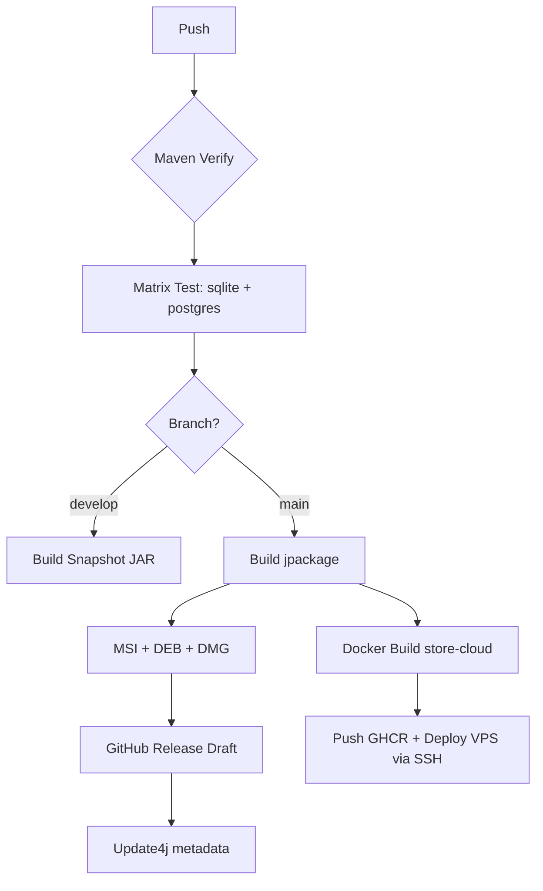

# SOSHA POS & INVENTORY MANAGEMENT SYSTEM
## VOLUME 8: DEPLOYMENT - v2.0 Desktop Native + Store Cloud

---

## 1. Philosophy
v1: Dual-Cloud (Vercel + Supabase). **v2: Desktop Native First, Cloud Optional.**

*   **Zero-Downtime Lokal:** Update via installer MSI/DEB/DMG (jpackage), bukan redeploy cloud.
*   **Atomic Desktop:** Flyway migrate otomatis saat startup, rollback via backup file.
*   **Cloud Minimal:** Hanya Store Online (Docker Spring Boot + PG Cloud) untuk PUBLIC data.
*   **IaC Hybrid:** Maven + jlink + jpackage + Docker Compose + GitHub Actions.

---

## 2. Environment Strategy

| Env | Purpose | Infra | Branch |
| :--- | :--- | :--- | :--- |
| **Dev** | Laptop dev | SQLite file + Python venv | `develop` |
| **Staging** | QA dual-DB matrix | PG 16 Docker + SQLite | `release/*` |
| **Production Desktop** | User PC | jpackage installer (SQLite/PG) | `main` |
| **Production Cloud** | Store Online | VPS Docker Compose (Store API + PG Cloud) | `main` |

---

## 3. Local Dev with Docker (for PG mode) + Native (SQLite)

**SQLite Mode:** No Docker needed - `mvn javafx:run -Dspring.profiles.active=sqlite`

**PostgreSQL Mode:**
```yaml
# docker-compose.dev.yml
services:
  pg:
    image: postgres:16
    environment: {POSTGRES_DB: sosha, POSTGRES_PASSWORD: sosha}
    ports: ["5432:5432"]
    volumes: [pgdata:/var/lib/postgresql/data]
  store-cloud:
    build: ./store-cloud
    ports: ["8081:8080"]
    depends_on: [pg]
```
Dev: `docker compose -f docker-compose.dev.yml up -d` -> `mvn spring-boot:run -Dspring.profiles.active=postgres`

---

## 4. CI/CD Pipeline (GitHub Actions)



**Key Jobs**
```yaml
jobs:
  test:
    strategy: {matrix: {profile: [sqlite, postgres]}}
    steps:
      - run: mvn test -Dspring.profiles.active=${{matrix.profile}}
      - run: mvn -pl python-sidecar test  # pytest
  package:
    runs-on: ${{matrix.os}} # windows, ubuntu, macos
    steps:
      - run: mvn jpackage:jpackage -P${{profile}}
      - uses: softprops/action-gh-release@v1
```

---

## 5. Desktop Distribution (jpackage)

**Build**
```bash
mvn package jlink:jlink jpackage:jpackage
# Output: target/dist/Sosha-2.0.0.msi (Win), sosha_2.0.0_amd64.deb, Sosha-2.0.0.dmg
```

**jpackage Config (pom.xml)**
```xml
<configuration>
  <name>Sosha</name><appVersion>2.0.0</appVersion>
  <vendor>Sosha</vendor><runtimeImage>target/jlink</runtimeImage>
  <resourcesDir>src/main/resources</resourcesDir>
  <installerType>msi</installerType>
  <javaOptions><option>-Dsosaha.profile=${profile}</option></javaOptions>
</configuration>
```

**Size:** jlink stripped ~60MB + Python bundled ~40MB + app 30MB = ~130MB installer.

**Update:** Update4j `update.xml` hosted di `https://store.sosha.com/updates/` - app cek saat online, download delta.

---

## 6. Store Cloud Deployment (Docker)

**Dockerfile**
```dockerfile
FROM eclipse-temurin:21-jre
COPY target/store-cloud-2.0.0.jar app.jar
EXPOSE 8080
ENTRYPOINT ["java","-jar","/app.jar"]
```

**VPS Compose**
```yaml
services:
  store-api:
    image: ghcr.io/sosha/store-cloud:2.0.0
    env_file: .env # DB_URL, API_KEY
    ports: ["443:8080"]
  pg-cloud:
    image: postgres:16
    volumes: [pgdata:/data]
  caddy:
    image: caddy:2
    ports: ["80:80","443:443"]
```

Deploy: `ssh vps "docker compose pull && docker compose up -d"`

---

## 7. Network Security (Cloud only)

| Feature | Decision |
| :--- | :--- |
| TLS | Caddy auto Let's Encrypt TLS 1.3 |
| WAF | Caddy + CrowdSec / Cloudflare Tunnel opsional |
| Auth | `X-Tenant-Api-Key` HMAC |
| Desktop Offline | No network needed; firewall block all except store sync + update |

---

## 8. Monitoring

*   **Desktop Lokal:** Logback `~/.sosha/logs/` + `sosha.log` rotation 10MB, Sentry opt-in (hanya saat online)
*   **Store Cloud:** Loki + Grafana + Uptime Kuma
*   **Python Sidecar:** `python.log` + `/health` endpoint

---

## 9. Backup & Disaster Recovery

| Mode | Backup | Restore | RPO/RTO |
| :--- | :--- | :--- | :--- |
| **SQLite** | File copy `sosha.db` + wal + `python/chroma` ke `~/.sosha/backup/daily/` + external USB (scheduled Quartz 02:00) | Copy balik | RPO 24h, RTO 5 min |
| **PostgreSQL Lokal** | `pg_dump` cron + WAL archive | `pg_restore` | RPO 1h, RTO 15 min |
| **Store Cloud PG** | Daily `pg_dump` to S3 + PITR 7d | Restore to VPS | RPO 5 min |

**Desktop Rollback:** Installer menyimpan `sosha.db.bak` pre-migration; gagal migrate -> restore.

---

## 10. Use Case: Rollback Faulty Release

1. User lapor bug 2.0.1 -> Dev rollback Git tag `2.0.0`
2. GitHub Release `2.0.0` tetap tersedia -> user download MSI lama
3. DB auto downgrade via backup `sosha.db.bak`

No Vercel rollback needed.

---

## 11. Checklist

- [ ] `mvn jpackage` di 3 OS runner
- [ ] GHCR push store-cloud
- [ ] Caddy TLS + auto renew
- [ ] Quartz backup job
- [ ] Update4j metadata signed
- [ ] Test install di 2GB RAM VM (SQLite)

## 12. Risks

| Risk | Mitigasi |
| :--- | :--- |
| Installer gede | jlink strip + python slim |
| PG lokal install gagal | Fallback SQLite auto |
| VPS down | Store sync queue tahan offline, no data loss |

**End of Volume 8 v2.0**
